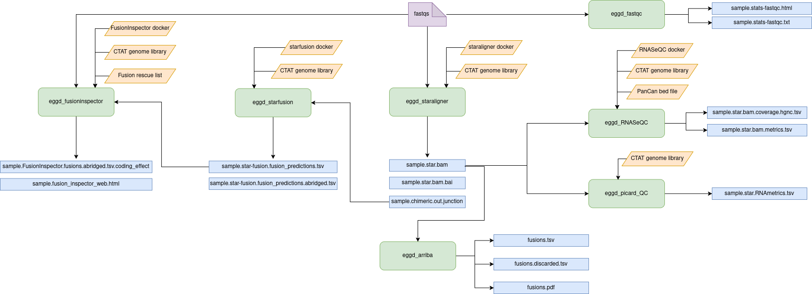

# eggd_eunomia_workflow (DNAnexus Platform Workflow)

DNAnexus workflow to support the Pan-Cancer service

---
## What version of apps are used in this workflow?

|  App 	| Version  	|
|---	|---	|
|eggd_staraligner       |[1.0.2](https://github.com/eastgenomics/eggd_staraligner/releases/tag/v1.0.2)|
|eggd_starfusion           |[1.0.0](https://github.com/eastgenomics/eggd_starfusion/releases/tag/v1.0.0)|
|eggd_fusioninspector             |[1.1.0](https://github.com/eastgenomics/eggd_fusioninspector/releases/tag/v1.1.0)|
|eggd_RNASeQC |[1.1.1](https://github.com/eastgenomics/eggd_RNASeQC/releases/tag/v1.1.1)|
|eggd_picard_QC           |[1.1.0](https://github.com/eastgenomics/eggd_picardqc/releases/tag/v1.1.0)|
|eggd_fastqc |[1.2.0](https://github.com/eastgenomics/eggd_fastqc/releases/tag/v1.2.0)|
